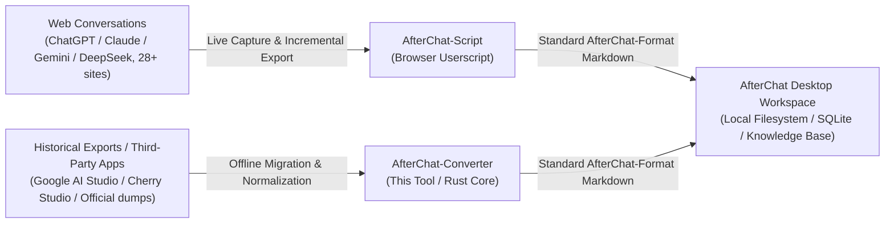

# AfterChat Converter

<p align="center">
  
  
  
  
</p>

<p align="center">
  <strong>English</strong> | <a href="README.zh-CN.md">简体中文</a>
</p>

Convert conversation backups from various AI platforms into standardized **AfterChat Markdown / ZIP** archives for local storage, migration, and offline reading.

Supports **5 backup sources**: Google AI Studio, Cherry Studio, Qwen, Claude, and RikkaHub. Generated Markdown documents can be directly imported into the [AfterChat](https://github.com/AfterThink/AfterChat-App-Download) workspace.

---

## Supported Backups

| Source | Input | Output |
| --- | --- | --- |
| Google AI Studio | Exported JSON | Markdown (Single file or directory tree) |
| Cherry Studio | Backup ZIP | Markdown ZIP |
| Qwen | Web exported JSON | Markdown ZIP |
| Claude | Data export ZIP | Markdown ZIP |
| RikkaHub | Backup ZIP | Markdown ZIP |

Example output structure:

```
chat-export-claude-all-1730000000000.zip
├── 20241114-101500-First_Conversation.md
├── 20241113-090000-Second_Conversation.md
└── export-failures.md          # Recorded here if a session contains no exportable messages
```

Platforms grouping by assistant (Cherry / Qwen / RikkaHub) include a subfolder:

```
chat-export-rikka-all-1730000000000.zip
└── Gemini/
    └── 20241114-101500-First_Conversation.md
```

## Downloads

Visit [Releases](https://github.com/AfterThink/AfterChat-Converter/releases) to download pre-built binaries:

| File | Description |
| --- | --- |
| `afterchat-converter_<version>_x64-setup.exe` | Installer: Desktop application (includes Start Menu shortcut and uninstaller) |
| `afterchat-converter-<version>-windows-x64.zip` | Portable: Extract and run `afterchat-converter.exe` directly |

## Usage

### Desktop Application

1. Launch the application and drag backup files (or folders) into the window.
2. The application automatically routes the file to the corresponding converter based on file attributes.
3. Upon completion, `chat-export-<platform>-all-<timestamp>.zip` is saved alongside the source file.

You can check "Output to custom directory" at the bottom of the window to select an alternative destination. See [docs/GUI.md](./docs/GUI.md) for details.

### Command-Line Interface (CLI)

Both the installer and portable archive contain 5 standalone executable binaries:

```powershell
rikka     RikkaHub-backup.zip        # RikkaHub backup (automatically extracts and reads SQLite DB)
cherry    cherry-backup.zip          # Cherry Studio backup
qwen      qwen-all.json              # Qwen export (supports multiple files)
claude    data-export.zip            # Claude data export archive
ai-studio prompt.json                # Google AI Studio export file
```

Outputs are saved in the source directory by default. Use `-o` to specify an output directory or file name:

```powershell
rikka backup.zip -o out\              # Writes to out\chat-export-rikka-all-<timestamp>.zip
rikka backup.zip -o out\my-name.zip   # Explicitly specifies the ZIP filename
```

Files can also be directly dropped onto individual executable icons in File Explorer (`ai-studio` outputs single Markdown files and is best run via CLI).

## Features

- **Unified Output Contract**: All converters adhere strictly to the [AfterChat-Format Specification](./docs/CHATFORMAT.md).
- **Reasoning Process Preservation**: Thought processes and final responses are cleanly separated as `#### 🤔 Thought Process` and `#### 💡 Response`.
- **Empty Session Aggregation**: Sessions without exportable messages are aggregated into `export-failures.md` instead of creating empty files.
- **Fault-Tolerant Processing**: Failure of an individual session does not interrupt the batch conversion process.

## Building from Source

Prerequisites: Rust (stable) and [Bun](https://bun.sh/):

```powershell
# Build 5 CLI converters
cargo build --release

# Build desktop application (sidecars are compiled and packaged automatically)
cd gui
bun install
bun run build
```

## The AfterChat Workflow Ecosystem

AfterChat Converter is an integral component of the AfterChat conversational data ecosystem, providing a complete end-to-end pipeline:



1. **Capture**:
   - **Web Sessions**: Export online chats seamlessly via the [AfterChat — LLM Chat Exporter (Script)](https://github.com/AfterThink/AfterChat-Script) browser extension.
   - **Offline Archives**: Batch convert historical backups and client databases into standardized formats using **AfterChat-Converter** (this tool).
2. **Normalize & Store**:
   - Standardized against the [AfterChat-Format Specification](./docs/CHATFORMAT.md), preserving chain-of-thought reasoning, metadata, and timestamps without loss of syntax.
3. **Discover & Manage**:
   - Import into the [AfterChat Desktop App](https://github.com/AfterThink/AfterChat-App-Download) for local knowledge base construction, semantic search, offline browsing, and multi-dimensional organization.

## License

This project is licensed under the [GNU Affero General Public License v3.0](LICENSE) (AGPL-3.0).
